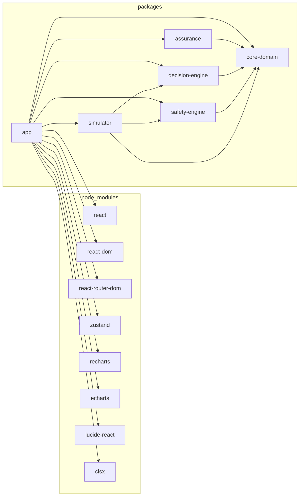

# System Architecture

## 1. Conceptual layered architecture

```
VESSEL OT SYSTEMS
(AIS, GNSS, Radar, ECDIS/Route Information, Engine, AMS/IAS, Electrical Power,
 Fuel, PMS, Cargo, Reefers, Safety Systems, Sensors)
        │
        ▼
READ-ONLY / CONTROLLED INTEGRATION GATEWAY
        │
        ▼
VESSEL OPERATIONAL DATA PLATFORM  (standardised data model + Digital Twin)
        │
        ▼
RULE ENGINE · ANALYTICS / ML · OPTIMISATION
        │
        ▼
DECISION FUSION
        │
        ▼
SAFETY ASSURANCE  (independent — never influenced by generative AI)
        │
        ▼
ASSISTANCE MANAGER
        │
        ▼
CREW HMI
        │
        ▼
HUMAN OPERATIONAL AUTHORITY
        │
        ▼
SECURE SHIP-SHORE GATEWAY
        │
        ▼
SHORE PLATFORM  →  SHORE ASSISTED OPERATIONS
```

All vessel-system connections above the integration gateway are **conceptual interfaces** in this prototype — the browser never has, and could never have, direct access to a vessel's OT systems or propulsion/machinery controls. In this demonstrator the same *shape* of data that gateway would carry is instead produced by the browser-based simulation engine described below. This diagram is also rendered interactively in-app at `/architecture`.

**Read-only / controlled integration gateway.** This layer name is deliberate: a real implementation would only ever *read* OT data (or write through a narrowly scoped, safety-cleared write path for genuinely low-risk, human-authorised actions such as an accepted voyage-speed profile). A browser tab, a cloud AI service, or a shore platform never has a direct line to a PLC, steering gear, or engine governor.

## 2. How the prototype realises each layer

| Conceptual layer | Prototype realisation |
|---|---|
| Vessel OT Systems | `src/simulation/baseline.ts`, `src/data/*` — synthetic starting values and identities |
| Integration Gateway / Data Platform | `src/types/*` (shared type system) plus `src/simulation/operationalState.ts`, which derives a formalised `VesselOperationalState` (value/unit/timestamp/source/quality/confidence/status per reading) from the single canonical snapshot |
| Digital Twin | `src/simulation/state.ts` (`SimulationState`) held in `src/store/simulationStore.ts`; visualised as a system topology in `src/features/vessel/DigitalTwinPage.tsx` |
| Rule Engine / Analytics / ML / Optimisation | `src/decision-engine/*` — trend/persistence/multivariate machinery analytics, recommendation builders, alarm correlation |
| Decision Fusion | `src/simulation/engine.ts` `tick()` — orchestrates which analytics fire and merges results into state |
| Safety Assurance | `src/safety-engine/*` (`oddEngine.ts`, `validate.ts`) — independent of both the decision engine and the Copilot/generative-AI layer |
| Assistance Manager | Recommendation lifecycle fields (`status`, `decidedByRole`, `outcome`) plus the L0–L4 assistance-level computation in `oddEngine.ts` |
| Crew HMI | `src/features/*`, `src/components/*`, `src/layouts/AppShell.tsx`, `src/components/layout/CommandRibbon.tsx` |
| Human Operational Authority | The Human Decision Centre (`src/features/assistance/DecisionCentrePage.tsx`) — Understand / Evidence / Simulate / Accept / Modify / Reject / Request Info / Request Shore Support |
| Secure Ship-Shore Gateway | Modelled as `communications` state (link up/down, confidence, latency) plus a store-and-forward `syncQueueCount` that drains on reconnection |
| Shore Platform / Shore Assisted Operations | `src/features/shore/ShoreCentrePage.tsx`, `ShoreCase` records in the store |

## 3. Connected-POC service boundary

Section 21/45 of the product brief asks for a documented backend boundary without requiring a real backend for the static public demonstration. This is implemented as a set of adapter interfaces under `src/services/adapters/`, each with a `Simulated`/`Offline` implementation and a `Connected` implementation:

| Adapter | Simulated / Offline | Connected |
|---|---|---|
| `TelemetryAdapter` | Reports `simulated` — the engine is always the source of vessel data | Attempts a status check against `/api/telemetry`; falls back honestly |
| `WeatherAdapter` | Mirrors the simulated environment state | Attempts `/api/weather`; falls back to simulated on any failure |
| `CopilotAdapter` | `deterministicCopilotAdapter` — fully local, state-grounded answers | `connectedAICopilotAdapter` — attempts `/api/copilot`, prefixes a fallback notice and reuses the deterministic answer if unreachable |
| `DocumentSearchAdapter` | Canned illustrative reference excerpts | Attempts `/api/documents/search` |
| `SystemHealthAdapter` | Reports `simulated` | Attempts `/api/system-health` |
| `AuditAdapter` | No-op (the in-session store is already the durable record) | Best-effort mirrors new events to `/api/audit` |
| `ShoreCaseAdapter` | No-op | Best-effort syncs case changes to `/api/shore-cases` |

`src/services/adapters/connectedGateway.ts` provides the single shared `attemptConnectedCall()` used by every connected adapter — a real `fetch` with a timeout, never a mocked success. No API key, token, or credential is ever read from the frontend; a real deployment would authenticate server-to-server, not from the browser. Toggle the mode at Engineering/Assurance → System Assurance; because no backend is deployed for the public build, Connected mode will always show every service falling back, and the Command Ribbon's "Data Provenance" reading always honestly reads `SIMULATED`.

## 4. Real-time / animation architecture

Engineering state (the simulation `tick()`) and visual rendering are deliberately decoupled:

- **Engineering tick**: driven by `src/hooks/useSimulationLoop.ts`, which runs off a Web Worker (immune to background-tab timer throttling) at roughly 1Hz, advancing simulated time by `elapsed real seconds × speed multiplier`.
- **Visual interpolation**: `src/hooks/useInterpolatedNumber.ts`, `useInterpolatedHeading.ts` (shortest-path compass interpolation, correctly handling 359°→0°), `useInterpolatedPosition.ts` and `useInterpolatedSignal.ts` animate values toward each new tick's result via `requestAnimationFrame`, so a value that only *changes* once a second still renders as continuous motion.
- The Navigation Operating Picture (`src/components/charts/NavigationCanvas.tsx`) runs its own internal rAF render loop over a `<canvas>` element, interpolating own-ship and target positions/headings imperatively (via refs, not React state) for performance, while historical track, predicted track, CPA/TCPA geometry, safety domain and wind are recomputed every frame from the live interpolated state.

## 5. Source tree

Since Phase 1A this is an npm-workspaces monorepo: `packages/*`, each with its own `package.json`
declaring exactly which sibling packages it depends on, rather than one `src/` tree.

```
packages/
  core-domain/           Shared TypeScript domain types, random/geo/format/theme helpers,
                         telemetryHistory, the simulation start-time constant. No dependencies.
  safety-engine/         Operational envelope (ODD) definitions & assessment, safety validation.
                         Depends on core-domain only (decision-engine/simulator are
                         devDependencies — test fixtures only, never a production dependency).
  decision-engine/       Machinery analytics (trend + persistence + multivariate cylinder spread),
                         recommendation builders, alarm correlation. Depends on core-domain only
                         (simulator is a devDependency — test fixtures only).
  simulator/
    simulation/          Baseline state, tick engine, navigation/alarm/health/telemetry-history
                         helpers, scenario effects, demo voyage phase sequencer,
                         operational-state/system-assurance selectors
    data/                Synthetic fixtures: route, voyage plan, fleet, vessel identity,
                         engineering-programme artifacts
                         Depends on core-domain, safety-engine, decision-engine.
  assurance/             Requirements traceability rows. Depends on core-domain only.
  app/                   Everything UI: components, features, hooks, layouts, services/adapters,
                         the Zustand store, App.tsx/main.tsx, e2e/. Depends on all of the above.
    src/
      components/
        ui/              Badge, Panel, Button, InstrumentRow, ProgressBar, Tabs, Modal, StatTile
        layout/           CommandRibbon, SideNav
        charts/           NavigationCanvas, VesselTopology, StreamingChart (ECharts), Sparkline (Recharts)
      hooks/              useSimulationLoop, useInterpolatedNumber/Heading/Position/Signal, useMetricHistory
      layouts/            AppShell (command ribbon + side nav + routed content)
      features/
        operations/       Operations Canvas (Bridge Operations mission-control view)
        engineering/       Engineering Operations (Chief Engineer workspace)
        vessel/            Digital Twin
        navigation/        Navigation situational awareness
        machinery/         Machinery Intelligence (streaming telemetry)
        maintenance/       Predictive Maintenance
        voyage/            Voyage & Energy Intelligence
        cargo/             Cargo / Reefer Intelligence
        safety/            Safety Intelligence
        alarms/            Intelligent Alarm Management
        assistance/        Envelope & Assistance (ODD), Human Decision Centre, Copilot, Scenario/Demo Voyage Control
        shore/             Shore Assisted Operations Centre
        audit/             Decision Audit Trail
        assurance/         System Assurance, Engineering Assurance, Requirements & Verification
        value/             Operational Value assessment
        architecture/      Interactive architecture view
        landing/           Landing / launch screen
        conops/            Concept of Operations page
      services/
        adapters/          Telemetry/Weather/Copilot/DocumentSearch/SystemHealth/Audit/ShoreCase adapters
        pocMode.ts         Connected-POC endpoint config and mode persistence
      store/               simulationStore (Zustand)
    e2e/                   Playwright acceptance-journey tests
docs/                    This documentation set
.github/workflows/       GitHub Pages deployment workflow
```

### 5.1 Package boundaries, enforced

Every arrow below is a real `dependencies` entry in a `package.json`, not an aspiration — see
`.dependency-cruiser.cjs`, which reads those `package.json` files and derives its rules from them,
and the `Check package boundaries (dependency-cruiser)` CI step that fails the build the moment an
import violates one. `npm run depcruise:graph` regenerates the diagram below from the live source
tree; the committed source lives at [`docs/dependency-graph.mermaid`](dependency-graph.mermaid).



Notably absent: nothing points at `app` — no package depends on the UI layer, including in tests
(`no-package-imports-app`). `safety-engine` and `decision-engine` resolve to nothing beyond
`core-domain` in production code (`safety-engine-prod-deps-match-package-json` /
`decision-engine-prod-deps-match-package-json`, scoped `allow-list`) — their test-only edges to
`simulator`/`decision-engine` (fixtures, declared as `devDependencies`) do not appear here because
this diagram is generated from production code only. And no module matching a generative/copilot
path pattern (today: `services/adapters/copilotAdapter.ts`; anticipated:
`packages/generative/**` for Phase 4) has an import path to `safety-engine`, in either direction —
per §4.5, Tier 3 assistive components must have none.

## 6. Decision-chain data flow (single tick)

1. **Sense** — `tick()` advances simulated time, position, and every continuous sensor-like value via a mean-reverting random walk toward a scenario-dependent target; new samples are pushed into rolling `telemetryHistory` ring buffers.
2. **Validate Data / Understand** — `recomputeSystemHealth()` and `analyseMainEngine()` (trend slope + persistence + cylinder-spread) turn raw values and history into anomaly/health scores and system states (NORMAL/DEGRADED/FALLBACK/CONTINGENCY).
3. **Correlate** — `decision-engine/alarmCorrelation.ts` groups raw alarms sharing a common-cause tag into correlated operational events.
4. **Predict / Optimise** — predictive-maintenance figures and voyage/energy trade-offs are computed from current trends and baselines.
5. **Recommend** — when a scenario-specific threshold is crossed, a builder in `decision-engine/builders.ts` produces a `RecommendationContent`.
6. **Safety Validate** — `safety-engine/validate.ts` independently checks operational mode, ODD (inside/near-limit/outside), sensor confidence, source-system availability, assistance-level ceiling and authority-gating, returning PASSED / CONDITIONAL / BLOCKED.
7. **Explain** — the recommendation carries evidence (each item tagged with its data provenance), confidence, analytical method, model/rule version and the safety-validation breakdown, all shown in the Human Decision Centre's Understand/Evidence/Simulate tabs.
8. **Human Decision** — a human role (or shore specialist) accepts, modifies, rejects, requests more information, or requests shore support. Nothing executes automatically.
9. **Controlled Action** — for this prototype, "action" is represented by the decision's `outcome` field (e.g. an L3-gated adopted speed profile, a hazard status change) — no vessel system is actually actuated.
10. **Monitor Outcome** — subsequent ticks continue to reflect the vessel's evolving condition, which the crew observes on the same views.
11. **Audit** — every step above appends a structured `AuditEvent` to the persistent-for-session audit trail, including assistance-level changes and fallback transitions as first-class event kinds.

## 7. State management

A single Zustand store (`useSimulationStore`) holds the entire `SimulationState` plus the actions that mutate it. Feature components subscribe to only the slices they need. The simulation clock ticks the store roughly once per second via a Web Worker (immune to background-tab timer throttling), scaled by elapsed real time and the selected speed multiplier — never by a fixed step — so the demo remains correct if the browser delays or batches callbacks.

## 8. Security posture (conceptual)

| Concern | Prototype posture | Real-system posture (conceptual) |
|---|---|---|
| Secrets | None present; none required | Managed via a backend secret store, never shipped to the browser |
| Vessel OT access | No OT connection of any kind | Read-only/controlled integration gateway only; no browser or cloud AI service ever reaches PLCs or propulsion/machinery control directly |
| Ship-shore transport | Simulated link state + store-and-forward queue count only | Authenticated, encrypted transport with real store-and-forward on link loss |
| Data layer access | In-memory client state | Role-scoped access to the standardised data layer, least-privilege by function |
| Safety logic integrity | Deterministic TypeScript, code-reviewable, independent of the Copilot | Would require independent verification & validation and change control (see [conops.md](conops.md)) |

## 9. Deliberate pragmatic substitutions

A few explicitly requested technologies were substituted for lighter, equally-honest alternatives given the constraints of a static, dependency-lean, GitHub-Pages-hosted demonstrator over synthetic (not real-world) geography — see `docs/assumptions.md` for the full list and rationale.
